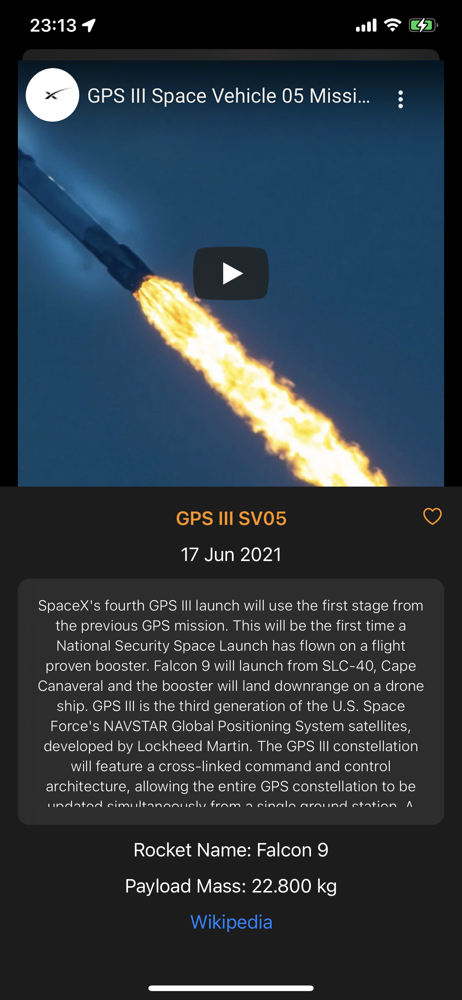

# ExuoSpaceX

An iOS application to display all SpaceX launches.

    
    

## Features

- Filter list by favourite, upcoming, name
- Save and display favourite launches
- Connection erros handling *TBD
- YouTube video of launch
- Launch details
- Rocket details of launch
- Wikipedia link
- iPhone and iPad support

## Packages used

- Telescope https://github.com/persello/telescope.git
- YouTubePlayerKit https://github.com/SvenTiigi/YouTubePlayerKit.git
